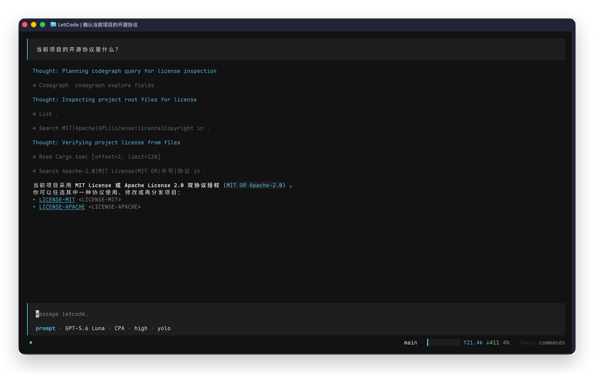

<h1 align="center">
  LetCode
</h1>

<p align="center">
  letcode is a terminal Agent written in Rust.
</p>

<p align="center">
  <a href="https://github.com/letr007/letcode/actions/workflows/test.yml"></a>
  <a href="CHANGELOG.md"></a>
  <a href="LICENSE-MIT"></a>
</p>

<p align="center">
  <a href="README.zh-CN.md">中文</a> | English
</p>



It provides an `opencode`-style TUI based on Ratatui, and also keeps a REPL CLI mode.

## Build and run

```sh
cargo build
cargo test
cargo fmt --check
```

Run the default TUI:

```sh
cargo run
```

Run the line-based CLI:

```sh
cargo run -- --cli
```

CLI mode can also be selected with `cli` or `repl`. TUI can be selected explicitly with `--tui` or `tui`.

## Configuration

`letcode` loads configuration from:

```text
~/.config/letcode/letcode.toml
```

Minimal example:

```toml
active_provider = "openai"

[global]
# Optional runtime limits:
# max_iterations = 64
# max_tool_calls = 128
sessions_dir = "sessions"
log_file = "logs/combined.log"

[permissions]
mode = "default" # safe/default/auto/yolo; legacy solo remains accepted when reading
# auto = same Ask set as default, but a sticky reviewer expert answers approvals

# Optional reviewer model route used by permission mode "auto"
# [agents.reviewer]
# provider = "openai"
# model = "gpt-5.5"
# Optional provider-qualified routes selectable per delegation:
# allowed_models = ["openai/gpt-5.5"]

# Optional local execution policy. Reviewed read tools may declare parallel support;
# all other tools stay exclusive unless their handler explicitly opts in.
[tools.parallelism]
# "fs__read" = "parallel"
# "web__fetch" = "exclusive"

[providers.openai]
api_key = "YOUR_API_KEY"
base_url = "https://api.openai.com/v1"
protocol = "responses" # responses/completions
default_model = "gpt-5.5"

[providers.openai.models."gpt-5.5"]
display_name = "GPT-5.5"
# context_window = 400000
# effective_input_limit_tokens = 256000 # optional provider/model route input budget
supports_tools = true
parallel_tool_calls = false # allow one model response to request multiple tools
supports_reasoning = true
reasoning_effort = "medium" # model default
# Optional: restrict selectable levels and TUI cycle order.
# Supported values: none, minimal, low, medium, high, xhigh, max
reasoning_efforts = ["none", "low", "medium", "high", "max"]
reasoning_summary = "auto"
text_verbosity = "medium"
```

Provider API keys and base URLs can also come from environment variables named from the provider, for example `OPENAI_API_KEY` / `OPENAI_BASE_URL`; for a provider named `compat`, use `COMPAT_API_KEY` / `COMPAT_BASE_URL`.

Relative `sessions_dir` and `log_file` paths are resolved relative to the config file directory.

Optional Langfuse/OpenTelemetry tracing is off by default. Enable it with `LETCODE_LANGFUSE_ENABLED=true`, and set `LANGFUSE_PUBLIC_KEY`, `LANGFUSE_SECRET_KEY`, and optional `LANGFUSE_HOST` (or the same variables in a local `.env`). Missing credentials leave tracing disabled without stopping the agent.

## Sessions

Session transcripts are stored as append-only JSONL under `sessions_dir` and can be restored later. In the TUI, use `/tree` to browse history, `/undo` / `/redo` to move between completed user turns, and `/help` for all local commands. The line-based CLI supports `/tree` as a read-only listing; `/undo` and `/redo` require the TUI.

## Changelog

See [CHANGELOG.md](CHANGELOG.md) for release notes.

## License

This project is dual-licensed under the MIT License OR the Apache License 2.0.
You may choose either license when using, modifying, or redistributing this project.

- MIT License: see [LICENSE-MIT](LICENSE-MIT)
- Apache License 2.0: see [LICENSE-APACHE](LICENSE-APACHE)
