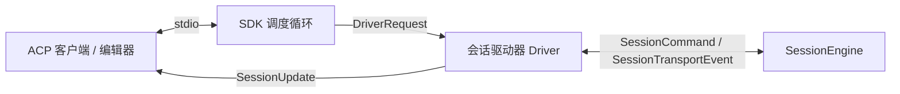

# ACP 服务端

letcode 实现了 Agent Client Protocol（ACP）协议服务端。外部编辑器（如 Zed）或自动化调度中心可通过标准输入输出（stdio）直接对接 letcode，无需借助终端界面即可驱动完整会话。

通过以下命令启动 ACP 模式：

```sh
letcode acp
```

## 协议通信与事件驱动

ACP 基于标准输入输出运行。协议 SDK 的请求回调运行在内部调度循环中；若在回调内直接等待客户端响应，会导致通信死锁。

系统采用通道转发的双层架构：



回调函数仅将客户端请求封装为 `DriverRequest`，通过异步通道发送给前台的驱动器 `Driver`。驱动器持有会话命令通道 `SessionEngineIngress` 与事件消费通道，统一执行客户端往返交互，避免调度循环阻塞。

## 会话生命周期与设置

驱动器将 ACP 的会话管理指令映射到底层引擎操作：

- `session/new`：初始化新会话，重置运行时快照与上下文环境；
- `session/load`：根据会话 ID 加载既有会话日志，恢复历史对话与分支上下文；
- `session/list`：扫描当前工作区的会话文件，支持基于游标的分页列举；
- `session/prompt`：接收用户消息，支持文本内容与 Base64 编码的图片附件；
- `session/cancel`：向活动回合发送中断信号，停止当前工具执行或模型推理。

客户端可通过配置选项动态调整会话参数：

- 权限模式：切换 `safe`、`default`、`auto` 或 `yolo`；
- 模型选择：在可用模型清单中切换当前会话的执行模型；
- 思考深度：设置 `none`、`low`、`medium`、`high` 或 `max` 推理级别。

## 事件投影与状态同步

`AcpUpdateProjection` 负责将引擎内部的 `SessionTransportEvent` 转换为 ACP 协议定义的增量更新：

- 助手回复：增量推送文本分块，保证客户端打字机式平滑渲染；
- 思考过程：将思考增量映射为思考块更新，支持折叠与耗时记录；
- 工具调用：实时同步工具启动、参数填充、执行状态与返回结果；
- 待办计划：将内部待办快照转换为 ACP 任务计划（Plan），按状态映射为待处理、进行中或已完成；
- 会话状态：在回合完成时发送 `stop_reason`，告知客户端本轮结束。

## 人机交互与审批桥接

ACP 模式下，系统将内部的人机交互统一转换为协议原生请求：

- 权限审批：工具执行触发拦截时，驱动器发起 `session/request_permission` 请求。客户端弹窗展示工具详情与操作参数，用户可选择单次允许（`allow_once`）、始终允许（`allow_always`）或拒绝执行（`reject_once`）；
- 表单提问：当模型调用 `question` 工具提问时，驱动器利用 ACP 表单交互机制（Elicitation）创建结构化输入表单。若客户端不支持该特性，系统直接向模型返回客户端不支持表单交互的提示；
- 斜杠命令：驱动器在前置拦截层解析用户输入的斜杠命令（如 `/compact`），并直接转换为底层的维护指令，无需经过大模型调度。

## 源码索引

- `src/acp/mod.rs`：定义 ACP 服务端启动入口、生命周期参数与外部连接处理。
- `src/acp/driver.rs`：实现前台驱动器主循环，桥接协议请求与引擎命令通道。
- `src/acp/projection.rs`：将内部会话传输事件投影为 ACP 协议格式的更新。
- `src/acp/session_state.rs`：维护客户端可见的会话配置状态与模型摘要。
- `src/acp/slash.rs`：解析客户端输入中的斜杠命令并分发处理。
