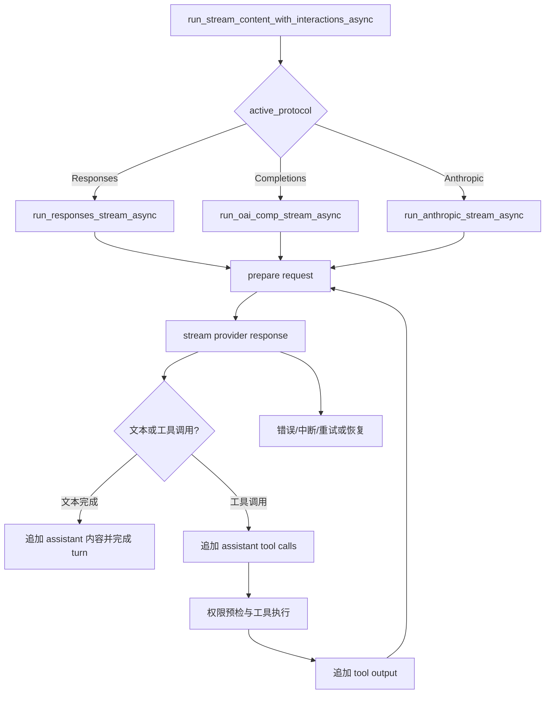

# Agent

## 概览

`Agent<C>`（`src/agent.rs:628`）是一次模型 turn 的有状态执行器。它持有当前模型路由、协议选择、运行时上下文快照、协议历史、工具注册表、权限会话、turn 计数与限制，以及请求重试和上下文压缩配置。一次 turn 通过协议流向模型发送请求；模型可以返回文本、推理片段或工具调用。工具结果被写回协议历史后，Agent 继续下一轮模型迭代，直到得到可完成的文本响应、达到迭代/工具调用限制，或出现不可恢复错误。

## 初始化与路由

`Agent::new` 接收 `Client<C>`、模型标识、最大迭代次数和最大工具调用次数。初始化内容包括：

- 当前模型和默认协议 `Responses`；
- 默认 Agent prelude 和以模型为基础创建的 `RuntimeSnapshot`；
- 空的协议追加状态，以及默认工具注册表；
- 技能注册表、子 Agent 委托和路由工厂的空状态；
- 默认权限会话、上下文压缩配置和重试配置；
- 默认工具超时 60 秒；
- 初始 `TurnRuntimeState`、turn ID 计数器和调用上限；
- 请求投影代数、逻辑请求观测、provider usage 锚点等运行时状态。

路由工厂构造 `PreparedPrimaryRoute`，再通过 `PreparedPrimaryRouteInstall::apply`（`src/agent.rs:455-473`）调用 `Agent::apply_route`（`src/agent.rs:1992-2008`）。路由安装会替换 client、默认协议、模型协议表、模型元数据和重试配置，并设置 primary route 与当前模型。设置模型会使请求投影失效，下一次请求会按新路由重新构造。

当前协议由 `Agent::active_protocol`（`src/agent.rs:1692-1697`）根据当前模型在模型协议表中的配置决定，支持：

- `ApiProtocol::Responses`；
- `ApiProtocol::Completions`；
- `ApiProtocol::Anthropic`。

## Turn 入口与控制回调

`Agent::run`（`src/agent.rs:2856-2867`）是非流式回调场景下的便捷入口，使用空的 delta 和 event 回调，并默认允许一次权限操作。交互式调用使用 `run_stream_async`（`src/agent.rs:2869-2898`）：它把字符串包装成 `UserMessageContent`，并为不支持提问的调用提供一个会返回错误的默认提问处理器。

统一入口 `run_stream_content_with_interactions_async`（`src/agent.rs:2932-2991`）完成两件事：

1. 用 `QuestionHandlerGuard` 临时安装本次调用的 `ask_question` 回调；调用结束后恢复 Agent 原有处理器。
2. 根据 `active_protocol()` 分派到三个协议流执行器，并把以下回调继续向下传递：
   - `on_delta`：可见文本增量；
   - `on_event`：推理、工具、usage、重试、压缩和 turn 生命周期事件；
   - `approve`：权限请求的人工或上层决策；
   - 已安装的 question handler：模型调用 question 工具时使用。

会话层调用 `src/session/runner.rs:341-372` 的 `AgentRunner::run_prompt` / `run_prompt_with_continuations`。后者先通过 `turn_continuation_provider_guard` 安装 continuation provider，再调用带选项的 prompt 执行路径；continuation provider 在 turn 内由 Agent 读取队列中的待处理 continuation。

## Turn 循环

三个协议执行器的 turn 结构相同，协议差异集中在请求发送和流解析。以 Chat Completions 为例，`src/agent/protocol_stream.rs:1237-1287` 展示了共同的初始化阶段：

1. 生成包含技能选择的 turn prelude：`try_prepare_turn_prelude_with_skills`。
2. 记录当前 active history 长度为 `protected_start_index`，并设置 `current_turn_start_index`。
3. 当 `UserMessageContent` 含有 parts 时，把用户消息追加到协议历史；追加通过 `Agent::append_history_item`（`src/agent.rs:2542-2553`）完成。
4. 发出 `AgentEvent::TurnStarted`，事件携带 turn ID、intent、directive 和 validation reminder。
5. 创建 turn tracing span，并初始化最终文本、工具调用数、continuation 数和恢复尝试数。
6. 进入带迭代预算的 `agent_iteration` 循环。每次迭代都先检查 `max_iterations`，再准备工具定义和本次协议请求。

请求准备由 `prepare_protocol_stream_request`（`src/agent/protocol_stream.rs:292-314`）转到规范化准备路径。该路径使用当前 prelude、`RuntimeSnapshot` 中的 active protocol frames、工具定义和模型元数据构建请求；同时计算请求预算、保留的历史和受保护内容，并在压力条件下触发请求级上下文压缩。

首次尝试成功提交逻辑请求和 active epoch；重试尝试不会重复提交相同的请求锚点。每次迭代都会发出请求 telemetry，包含逻辑请求 ID、turn/iteration/attempt、模型、协议、工具数量和预算信息。

## 协议流处理

### Responses

`run_responses_stream_async`（`src/agent/protocol_stream.rs:443`）使用 typed 或 compatible Responses 请求，也支持 fake Codex 请求。provider 事件先经过 `project_response_stream_event`（`src/agent/protocol_stream.rs:223-229`）投影和反序列化，以统一不同 provider 的 side-band 字段。文本增量通过 `on_delta` 输出；推理增量通过 `AgentEvent::ReasoningDelta` / `ReasoningDone` 输出；工具调用累积为 `HistoryToolCall`。响应 usage 会转换成 `TokenUsageEstimate` 并通过事件更新外部状态。

Responses 的终止事件会区分 completed、failed、error 和 incomplete。completed 事件在没有先收到文本 delta 时还可以从完整 response payload 中补出文本；failed、error 或 incomplete 会形成错误路径而不会被当作正常完成。

### Chat Completions

`run_oai_comp_stream_async`（`src/agent/protocol_stream.rs:1237`）发送 typed 或 compatible `/chat/completions` 请求。SSE 字节块先追加到缓冲区，再由 `drain_sse_data_events` 拆出 `data` 事件（`src/agent/protocol_stream.rs:3288-3313`）。compatible 响应使用 `CompatibleChatCompletionStreamResponse`（`src/agent/protocol_stream.rs:3125-3130`）及其 delta 类型解析文本、工具调用和 provider 变体的 reasoning 字段；reasoning 的 `reasoning_content`、`reasoning` 和 `thinking` 字段由 `reasoning_delta`（`src/agent/protocol_stream.rs:3197-3216`）统一读取。

响应的 finish reason 必须与是否存在工具调用相匹配。`validate_chat_finish_reasons`（`src/agent.rs:5694-5725`）拒绝缺少 finish reason、length、content filter 或不符合当前响应类型的终止状态。没有工具调用且 finish reason 表示正常停止时，当前文本进入完成路径；有工具调用时，assistant tool-call 历史先落盘，随后执行工具并开始下一次迭代。

### Anthropic Messages

`run_anthropic_stream_async`（`src/agent/protocol_stream.rs:2483`）发送 `/messages` 流请求，并通过 SSE 解析 Anthropic 事件。`AnthropicStreamState::handle_event`（`src/agent/protocol_stream.rs:2144-2327`）维护：

- `text`：文本块和 `text_delta` 的累计内容；
- `thinking`：thinking block、签名和 reasoning 事件；
- `tool_calls`：`tool_use` 初始输入及后续 `input_json_delta`；
- input/output/cache usage；
- stop reason 和 `message_stop` 完成状态。

工具调用在 `tool_calls`（`src/agent/protocol_stream.rs:2365-2397`）中校验 call ID、名称和 JSON object 参数。`validate_completion`（`src/agent/protocol_stream.rs:2399-2413`）要求收到 `message_stop`，拒绝 `max_tokens`、缺失 stop reason，以及没有对应 tool block 的 `tool_use` stop reason。

## 工具交互

provider 生成的工具调用最终进入 `Agent::execute_tool_calls_and_record`（`src/agent.rs:3257-3432`）。每个调用的核心顺序是：

1. 解析 JSON 参数并解析 Agent 内部工具别名；别名在权限、执行和记录阶段统一成真实工具名。
2. 检查工具是否存在或有可用的 subagent delegate、工具 scope、当前 turn directive 和并行能力。
3. 根据工具权限类别和参数构造 permission resource。若决策为 `Ask`，调用 `approve`；Auto 模式则走 Agent 的自动审核服务。允许 `AllowAlways` 时，会把当前 resource 写入 session grant。
4. 发出 `ToolCallStarted`，执行工具 handler，并把流式工具输出转为 `ToolOutputDelta`。`ToolRegistry::call_streaming`（`src/tool/registry.rs:156-181`）负责 scope 检查、未知工具处理和 handler 调用；handler 错误会转换为失败的 `ToolResult`。
5. 发出 `ToolCallFinished` 和 `ToolExecutionSummary`，记录工具效果、状态、拒绝原因、主路径或命令信息。
6. `record_tool_call_result`（`src/agent.rs:3434-3488`）把结果转换为 `HistoryItem::ToolOutput`，写入 `RuntimeSnapshot`，刷新 projected token usage，并在适用时记录 evidence。工具输出中的图片保留给外部事件，但写入文本历史时使用 `ToolResult::for_text_history` 清除图片字段。

当模型和工具都声明支持时，连续的普通工具调用会先统一完成结构与权限预检，再并行执行，最后按模型顺序 reconcile 和写回历史。subagent 工具使用独立的批处理路径，并在模型顺序中完成各条结果的历史、证据和取消状态收敛。任一调用被取消或 reconcile 失败，剩余调用会发出取消/终止记录，turn 进入错误路径。

## 上下文与历史

`RuntimeSnapshot` 是 Agent 当前协议上下文的权威存储。`Agent::active_history_items`（`src/agent.rs:1022-1024`）从 snapshot 的 active protocol frames 投影出 provider 可用历史。

协议历史项由 `ProtocolItem`（`src/protocol_frames.rs:29-58`）表达，当前类型包括：

- `ContextSummary`：压缩后的上下文摘要；
- `UserMessage`：带文本、图片 parts 和 selected skills 的用户消息；
- `InternalContinuation`：内部 continuation 消息；
- `AssistantText`：普通 assistant 文本；
- `AssistantToolCalls`：assistant 文本/推理状态与工具调用；
- `ToolOutput`：按 call ID 关联的工具结果和图片。

`append_history_item` 会把历史项转换成 derived `ProtocolFrame`，附加 source provenance 后写回 snapshot。这使协议历史、运行时 frame、压缩引用和 prompt contributor 保持同一套 frame identity。snapshot 的 active frames 再被 request builder 用于构造 provider 请求。

请求准备阶段会把静态 Agent prelude、当前 turn 的技能材料、active history、工具定义、evidence 和模型预算组合起来。当前 turn 起点保存在 `turn.current_turn_start_index`，并作为受保护边界参与压缩和请求投影。压缩计划由 `src/agent/history_compact.rs:23-96` 的 `plan_turn_cut` / `plan_turn_cut_with_transcript` 计算：保留最近 token 尾部，并将截断点规范化到完整工具调用边界；必要时把可压缩前缀写成 `ContextSummary`，避免留下孤立的 assistant tool call 或 tool output。

provider 返回的 usage 会进入 `TokenUsageEstimate`。工具结果写回历史后，Agent 可以发出一次只刷新投影的 `TokenUsageUpdated`，且不重复累计当前响应的 output tokens。

## 完成、继续与错误路径

正常完成时，协议执行器把累计的可见文本作为返回值，并将 assistant 文本或 assistant tool-call 内容写入协议历史。turn 完成事件由 `turn_finalized_event`（`src/agent.rs:3862-3879`）生成，包含 turn ID、outcome、工具调用数、continuation 数、写入/验证效果和 validation advisory 状态。`finish_current_turn`（`src/agent.rs:3881` 起）清理 turn 级自动继续和其他临时状态；调用方最终得到 `Result<String>` 中的 final text。

如果本次模型响应产生了工具调用，当前迭代在工具 output 写回后继续进入 `agent_iteration`，直到模型以无工具调用的有效终止状态返回。已安装的 `TurnContinuationProvider` 会在循环中提供排队的 continuation；迭代预算由 `ensure_iteration_budget` 约束，超出 `max_iterations` 或 `max_tool_calls` 时返回错误。

流式错误按是否已经产生副作用区分：

- 请求创建失败，或尚未产生副作用的流读取失败，可以依据 `RetryConfig` 重试；重试生命周期通过 `LlmRetryScheduled` / `LlmRetryStarted` 和失败 telemetry 事件暴露。
- 已产生文本、推理或工具调用后发生的流中断，不能把部分响应当成完整响应；执行器发出 interrupted telemetry，并在恢复次数允许时以新的迭代继续。
- provider 明确返回 failed/error/incomplete，或协议终止状态校验失败时，turn 返回错误。
- `on_event` 的审计事件由 `Agent::emit_audit_event`（`src/agent.rs:3836-3851`）投递；审计回调自身失败会记录 warning，但不会改变 Agent turn 的主执行结果。直接参与协议或工具状态推进的回调错误则由相应异步路径返回。

## 可观察事件

`AgentEvent` 的生命周期事件定义在 `src/agent/events.rs:493` 起。与一次 turn 直接相关的事件包括：

- `TurnStarted`、`TurnFinalized`；
- `ReasoningDelta`、`ReasoningDone`；
- assistant 文本 delta 对应的上层 session 事件；
- `ToolCallPending`、`ToolCallStarted`、`ToolOutputDelta`、`ToolCallFinished`、`ToolCallCancelled`、`ToolExecutionSummary`；
- `TokenUsageUpdated`、请求 telemetry、retry scheduled/started；
- `ContextCompacted`、`EvidenceRecorded`、`ValidationAdvisory`；
- permission/question 请求及其解析结果；
- 错误和中断事件。

delta 和生命周期事件在请求进行中输出；`Result<String>` 在 Agent 完成或失败后返回最终文本或错误。
