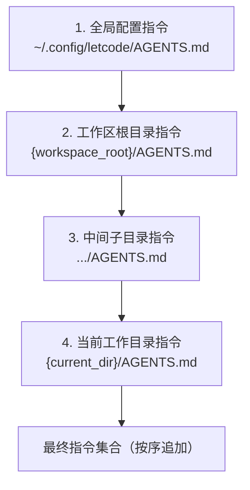

# 指令系统与 AGENTS.md

letcode 采用基于 `AGENTS.md` 的层级指令系统。通过在全局配置目录与项目目录中放置 `AGENTS.md` 文件，用户可以向模型声明代码规范、工程约束、架构约定与审查准则。

系统按确定顺序加载指令链，并通过大语言模型协议的原生高权威通道注入模型。

## 指令链发现与加载顺序

系统在初始化 Agent 时自动发现并加载指令链：

具体发现逻辑如下：

1. **全局指令**：首先读取 `~/.config/letcode/AGENTS.md`。若文件存在，作为全局通用规则载入；
2. **定位工作区根目录**：从当前工作目录（`current_dir`）向上逐级查找，以包含 `.git` 的最近祖先目录作为工作区根目录（`workspace_root`）。若未找到 `.git`，则以当前目录为根；
3. **层级下钻加载**：从工作区根目录开始，向下沿着通往当前目录的路径组件逐层检查。若路径下存在 `AGENTS.md`，则依次加载并追加到指令链末尾。

后加载的深层指令追加在先前指令之后。因此，子模块中的具体规范可以自然补充或覆盖根目录中的宽泛约定。

## 高权威指令注入契约

面向大语言模型的消息按权威层级分层注入。静态系统指令代表系统的核心行为边界，系统强制使用协议原生的最高权威通道传递：

| 服务商协议 | 原生注入字段 | 注入行为与约束 |
| --- | --- | --- |
| **OpenAI Responses** | 顶层 `instructions` 字段 | 系统指令作为顶层字段独立发送，不作为普通输入消息重复下发 |
| **OpenAI Completions** | `system` 角色消息 | 格式化为对话序列起始处的独立 `system` 消息 |
| **Anthropic Messages** | 顶层 `system` 字段 | 系统指令作为顶层字段独立发送，不包装进 `messages` 数组 |

系统对指令与动态上下文做严格区分：

- **高权威静态指令**：全局与工作区 `AGENTS.md`、子代理专家角色设定、会话标题与压缩专用指令。必须通过原生系统通道注入，确保指令拥有最高执行权威；
- **动态会话材料**：技能目录、技能卡片、日期时间、运行时环境、执行证据与待办事项。保持为普通开发者或会话材料，不无差别提升为核心系统指令。

该机制避免了静态工程规范被动态对话稀释，同时防止模型将临时会话内容误判为永久系统限制。

## 编写建议与实践准则

在编写 `AGENTS.md` 时，建议遵循以下工程原则：

1. **言简意赅**：优先使用平实的陈述句与肯定句，明确规定具体行为准则；
2. **结合版本控制**：项目根目录下的 `AGENTS.md` 适合纳入 Git 版本控制，供团队共享开发规范；
3. **私有配置隔离**：不希望提交到代码库的个人偏好规则，可存放在 `~/.config/letcode/AGENTS.md` 全局配置中；
4. **子模块独立细化**：在大型单体仓库（Monorepo）中，可以在各子项目目录下放置独立的 `AGENTS.md`，专门约束该子模块的技术栈与测试要求。

## 源码索引

- `src/agent.rs`：实现 `load_instruction_files_from` 与 `load_workspace_instructions` 的路径解析与加载逻辑。
- `src/request_builder/prompt_plan.rs`：将高权威指令与动态素材按等级规划为 Prompt 计划分段。
- `src/model_runtime/projection.rs`：将计划分段映射为语义请求模型中的控制分段。
- `src/model_runtime/adapters.rs`：将控制分段编码为各服务商协议的原生高权威字段（`instructions` 或 `system`）。
