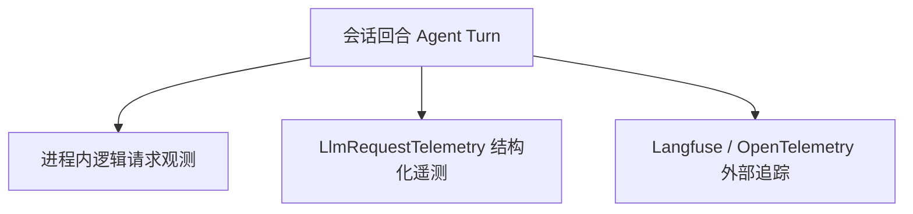

# 可观测性与调用追踪

letcode 提供多层级的运行时可观测性与调用追踪支持。系统既支持在进程内部收集轻量级的逻辑请求观测与指标遥测，也支持通过 OpenTelemetry 与 Langfuse 导出结构化的分布式追踪数据。

## 遥测分层模型

可观测性体系划分为三个层次：



1. **逻辑请求观测（`LogicalRequestObservation`）**：在发送网络请求前生成，度量请求结构特征、分段类型与字节大小，仅保存在当前进程内存中；
2. **结构化请求遥测（`LlmRequestTelemetry`）**：将模型标识、协议类型、重试轮次、Token 预算与执行状态关联，作为事件记录存入会话日志；
3. **外部调用追踪（Langfuse）**：将端到端的回合生命周期、大模型生成事件与工具执行状态导出至 Langfuse 服务端，用于线上监控与质量评估。

## Langfuse 追踪体系

系统通过 `tracing` 生态无缝对接 Langfuse。开启该功能需在环境中声明凭据：

```sh
export LETCODE_LANGFUSE_ENABLED=true
export LANGFUSE_PUBLIC_KEY="pk-lf-..."
export LANGFUSE_SECRET_KEY="sk-lf-..."
# 可选：自建服务地址（默认连接官方云端网关）
export LANGFUSE_HOST="https://cloud.langfuse.com"
```

在缺少上述环境变量时，追踪采集层保持静默关闭，不影响系统的正常执行。

### 1. 层次化 Span 拓扑

Langfuse 导出数据遵循树状跨度（Span）结构：

- **Trace 根节点**：绑定当前会话的 `session_id`，标签包含会话模型标识；
- **Turn Span**：对应单个用户提示词触发的交互回合，记录开始时间与完成耗时；
- **Generation Span**：记录单次底层大模型调用。上报模型名称、输入 Token、输出 Token、思考过程消耗以及 Prompt 缓存命中数据；
- **Tool Call Span**：为每个工具调用独立建立子 Span，记录工具名称、参数大小、权限审批等级、执行耗时与成功失败状态。

### 2. Prompt 缓存遥测

为了审计大模型服务商的 Prompt 缓存表现，系统在 Generation 跨度中附带 `CacheMetadataProjection` 结构化元数据：

- 稳定前缀分段数与可缓存 Token 估算；
- 发送给服务商的缓存保留策略；
- 服务商返回的实际缓存命中 Token 与写入 Token；
- 本地生成的前缀指纹与路由键。

## 数据脱敏与隐私保护

为了防止敏感数据在监控平台外泄，系统在采集层执行严格的数据脱敏：

- **拒绝采集原始 Prompt 字节**：进程内的逻辑观测与遥测日志只记录摘要哈希、字符计数与 Token 估算，不向持久化日志或外部追踪平台输出完整的 Prompt 文本；
- **网络凭据自动遮蔽**：请求头中的 API 密钥、Authorization 令牌均在生成事件前被统一替换为遮蔽占位符；
- **安全工具参数摘要**：对于涉及敏感参数的工具调用，遥测层仅记录参数的 JSON 字节长度与执行结果状态，不转储敏感参数内容。

## 源码索引

- `src/langfuse_trace.rs`：实现基于 tracing 的 Langfuse 跨度映射、缓存元数据投影与工具调用追踪。
- `src/request_builder.rs`：生成无 Prompt 文本的逻辑请求观测 `LogicalRequestObservation`。
- `src/agent/protocol_stream.rs`：在普通回合中组装并派发 `LlmRequestTelemetry`。
- `src/session/runner.rs`：将遥测事件转换为日志条目与传输层事件。
