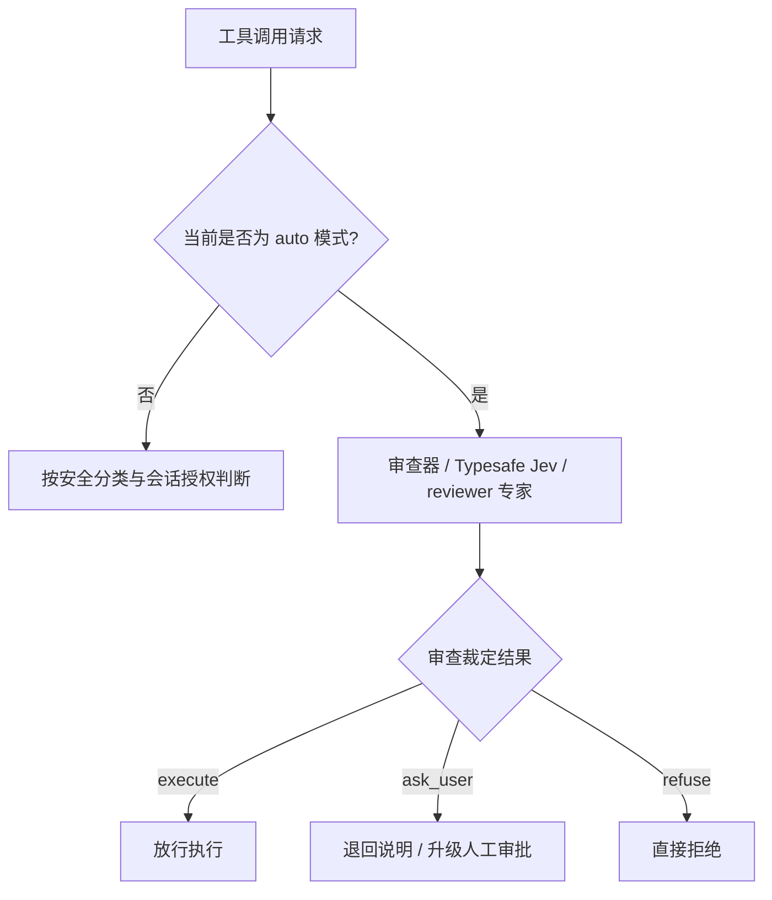

# 权限模型与安全审批

letcode 提供多层级的权限控制与安全审批机制。系统通过工具安全分类、运行模式约束、会话级授权与智能审查，防止恶意命令或意外修改破坏工作区。

## 运行模式

用户可以在配置文件 `letcode.toml` 中设置全局权限模式，也可以在 TUI 中使用 `/mode` 动态切换：

```toml
[permissions]
mode = "default" # safe | default | auto | yolo
```

四种运行模式的行为定义如下：

- **`safe`（安全严格模式）**：所有非系统内部工具的调用均需用户人工确认。任何文件读写、命令执行与网络请求都会触发审批弹窗；
- **`default`（默认开发模式）**：对工作区内的安全读取和差异预览直接放行；对文件修改、终端命令执行和外部网络请求弹出人工审批；
- **`auto`（自动化审查模式）**：读操作直接放行；高风险写操作由配置的安全审查器自动评估，根据风险程度决定放行、补充提问还是直接拒绝；
- **`yolo`（全自动模式，别名 `solo`）**：全量放行所有工具调用，跳过一切交互审批提示。适合隔离的容器或受信批处理流水线。

## 工具安全分类

系统根据工具执行的副作用将工具划分为五类：

| 安全类别 | 代表工具 | 默认模式策略 |
| --- | --- | --- |
| **`Read`（安全读取）** | `fs__list`、`fs__read`、`search__rg`、`git__status`、`git__diff`、`git__log` | 直接放行 |
| **`Preview`（只读预览）** | `code__ast_replace_preview` | 直接放行 |
| **`Write`（写入修改）** | `fs__write`、`fs__append`、`fs__mkdir`、`edit__apply_patch` | 触发审批 |
| **`Command`（命令执行）** | `shell__exec` | 触发审批 |
| **`Unknown`（未知分类）** | 未声明权限属性的外部 MCP 工具、未标注扩展 | 触发审批 |

系统内部工具（如 `question`、`workflow__todos`、`skill` 等）属于元操作，无需经过外部拦截判定。

## 会话级授权

在 `default` 模式下，用户面对审批弹窗可以做出三种决策：

1. **拒绝（Deny）**：取消本次工具执行，并将拒绝原因反馈给模型；
2. **允许一次（AllowOnce）**：仅放行本次特定参数的调用；
3. **始终允许（AllowAlways）**：在当前会话生命周期内，对匹配相同参数特征的后续调用免除弹窗确认。

始终允许的规则保存在内存中的 `SessionGrants` 中。会话级授权受代际保护，当工作区路径改变、权限模式切换或会话重置时，已记录的授权规则会自动清空。

## 智能审查机制

在 `auto` 模式下，系统通过配置的审查器自动进行风险裁决：



系统支持两种审查后端：

- **Typesafe Jev**：在配置中声明 `reviewer = "jev"` 的专用模型路由。审查时向接口发送 choice 评估请求，由后端返回安全概率值，确定操作放行阈值；
- **内置 `reviewer` 专家**：使用独立的专家模型路由，输出 `execute`、`ask_user` 或 `refuse` 的结构化裁决。若判定为 `ask_user`，系统先退回请求方补充理由；若仍然可疑，再弹出人工审批界面。

审查服务离线、调用异常或响应格式损坏时，系统按最严格标准直接拒绝，不冒进放行。在单次运行的 CLI 模式下（如 `--print`），无法弹出人机交互界面，此类调用直接以失败终止。

## 子代理权限继承与路径隔离

子代理受双重权限边界约束：

1. **模式继承**：子代理继承父会话当前的权限模式；
2. **路径锁边界**：无论权限模式为何种级别，子代理的操作严格受限于任务派发时声明的 `allowed_paths` 与 `owned_paths`。

只读专家（如 `explorer` 或 `oracle`）在任务模板中完全剔除了写操作工具，即使在 `yolo` 模式下也无法向磁盘写入文件。写专家（如 `fixer`）只能在其申请成功的独占所有权路径内进行修改，任何跨目录越界写入均会被文件层直接拦截。

## 源码索引

- `src/permission.rs`：定义权限模式枚举、工具安全类别分类、判定规则与会话授权存储。
- `src/session/runner.rs`：处理运行时工具拦截、异步审批等待与交互事件分发。
- `src/tool/command.rs`、`src/tool/fs.rs`：在工具实现底层对接权限类别与路径边界核验。
- `src/subagent/pool.rs`：管理子代理独占路径锁与操作权限范围。
