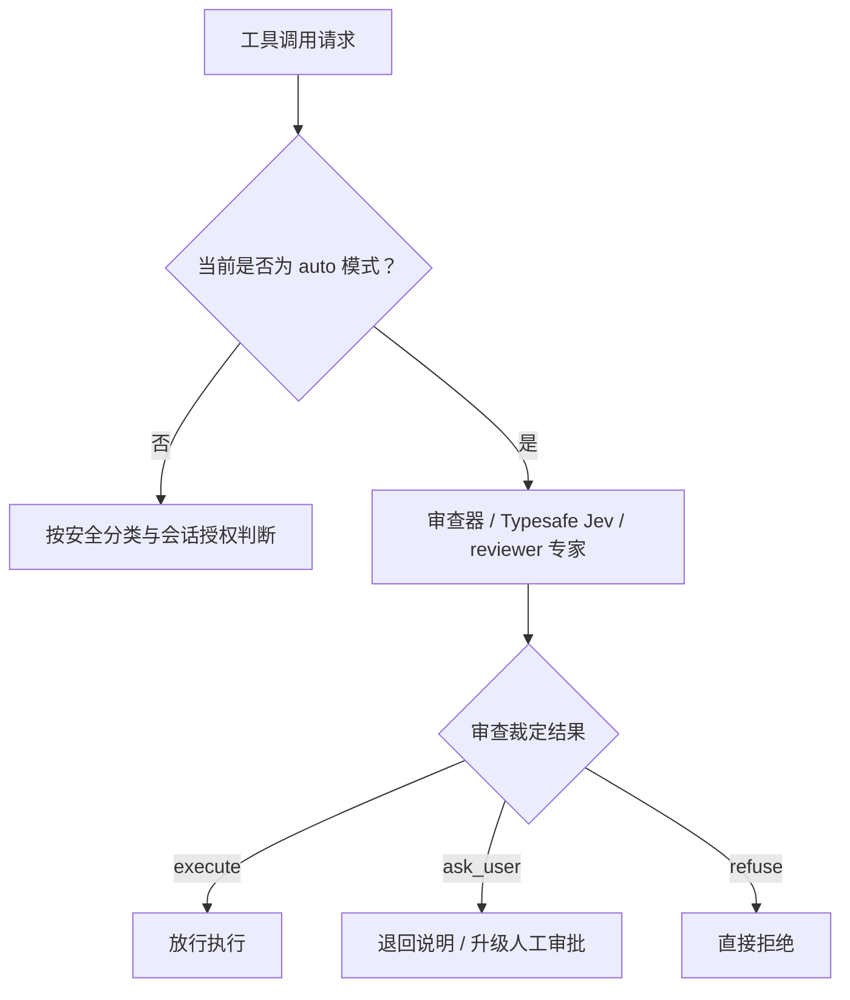

# 权限模型与安全审批

letcode 按工具类别、运行模式和会话授权决定审批方式。`auto` 模式使用审查专家或 Typesafe Jev。工具分类不能保证 shell 命令没有副作用。

## 运行模式

在 `letcode.toml` 中设置权限模式，也可在 TUI 中用 `/permission`（或 `/perm`）切换。

```toml
[permissions]
mode = "default" # safe | default | auto | yolo
```

四种运行模式的行为定义如下：

- **`safe`（安全严格模式）**：所有非系统内部工具的调用均需用户人工确认。任何文件读写、命令执行与网络请求都会触发审批弹窗；
- **`default`（默认开发模式）**：对工作区内的安全读取和差异预览直接放行；对文件修改、终端命令执行和外部网络请求弹出人工审批；
- **`auto`（自动化审查模式）** 沿用 `default` 的工具分类，需要审批的调用交给审查器。审查器可放行、要求补充说明、请求人工审批或拒绝；
- **`yolo`（全自动模式，别名 `solo`）** 跳过模式审批，工具范围和子代理路径限制仍然有效。

## 工具安全分类

系统按工具声明的权限类别或内置分类处理调用。

| 安全类别 | 代表工具 | 默认模式策略 |
| --- | --- | --- |
| **`Read`（安全读取）** | `fs__list`、`fs__read`、`search__rg`、`git__status`、`git__diff`、`git__log` | 直接放行 |
| **`Preview`（只读预览）** | `code__ast_replace_preview` | 直接放行 |
| **`Write`（写入修改）** | `fs__write`、`fs__append`、`fs__mkdir`、`edit__apply_patch` | 触发审批 |
| **`Command`（命令执行）** | `shell__exec` | 触发审批 |
| **`Unknown`（未知分类）** | 未声明权限属性的外部 MCP 工具、未标注扩展 | 触发审批 |

系统内部工具（如 `question`、`workflow__todos`、`skill` 等）属于元操作，无需经过外部拦截判定。

## 会话级授权

在 `default` 模式下，用户面对审批弹窗有三种选择：

1. **拒绝（Deny）**：取消本次工具执行，并将拒绝原因反馈给模型；
2. **允许一次（AllowOnce）**：仅放行本次特定参数的调用；
3. **始终允许（AllowAlways）**：在当前会话生命周期内，对匹配相同参数特征的后续调用免除弹窗确认。

始终允许的规则保存在内存中的 `SessionGrants` 中。会话级授权受代际保护，当工作区路径改变、权限模式切换或会话重置时，已记录的授权规则会自动清空。

## 自动审查

在 `auto` 模式下，系统通过配置的审查器自动裁决风险：


```mermaid
flowchart TD
    ToolCall[工具调用请求] --> ModeCheck{当前是否为 auto 模式？}
    ModeCheck -->|否| DefaultRule[按安全分类与会话授权判断]
    ModeCheck -->|是| Reviewer[审查器 / Typesafe Jev / reviewer 专家]
    Reviewer --> Decision{审查裁定结果}
    Decision -->|execute| Allow[放行执行]
    Decision -->|ask_user| Prompt[退回说明 / 升级人工审批]
    Decision -->|refuse| Reject[直接拒绝]
```

系统支持两种审查后端：

- **Typesafe Jev**：在配置中声明 `reviewer = "jev"` 的专用模型路由。审查时向接口发送 choice 评估请求，由后端返回安全概率值，确定操作放行阈值；
- **内置 `reviewer` 专家**：使用独立的专家模型路由，输出 `execute`、`ask_user` 或 `refuse` 的结构化裁决。判定为 `ask_user` 时，系统先退回请求方补充理由；仍然可疑时，再弹出人工审批界面。

审查服务离线、调用异常或响应格式损坏时，系统按最严格标准直接拒绝，不冒进放行。在单次运行的 CLI 模式下（如 `--print`），无法弹出人机交互界面，此类调用直接以失败终止。

## 子代理权限继承与路径隔离

子代理继承父会话当前的权限模式，不继承会话授权。

只读专家（如 `explorer` 或 `oracle`）不提供文件写入和 shell 工具。`fixer` 与 `general` 必须声明非空的 `owned_paths` 并取得写锁。结构化文件工具按规范化路径检查访问范围，越界写入在执行前拒绝。

路径声明不构成通用 shell 沙箱。`shell__exec` 走独立的命令审批，任务结束时的范围审计依赖报告中的文件清单和日志中的变更证据。

## 源码索引

- `src/permission.rs`：定义权限模式枚举、工具安全类别分类、判定规则与会话授权存储。
- `src/session/runner.rs`：处理运行时工具拦截、异步审批等待与交互事件分发。
- `src/tool/command.rs`、`src/tool/fs.rs`：在工具实现底层对接权限类别与路径边界核验。
- `src/subagent/pool.rs`：管理子代理独占路径锁与操作权限范围。
