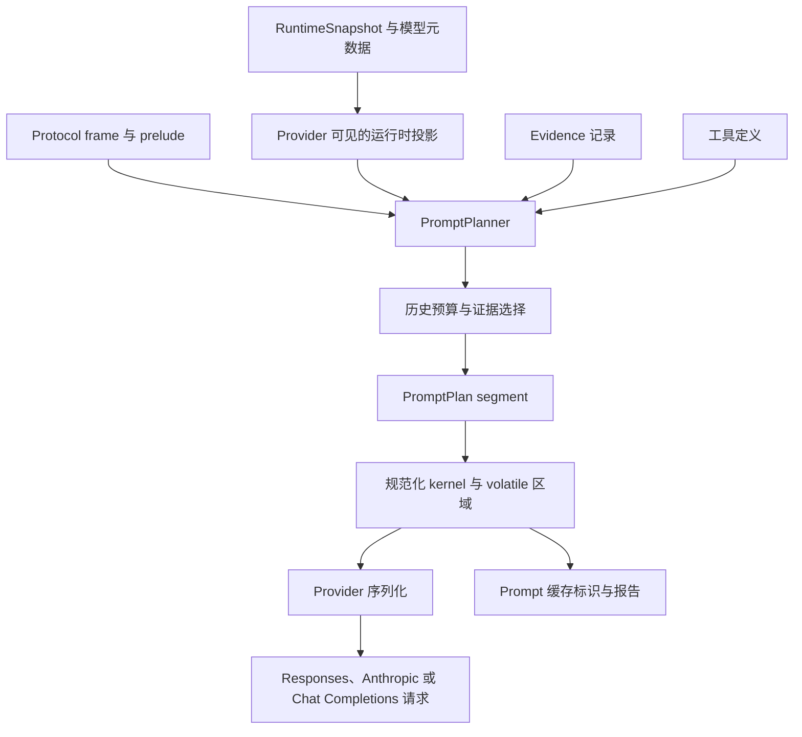

# 请求构建

请求构建将单次模型调用的运行时状态转换为 provider request。`PromptPlanner` 完成运行时投影、历史与 evidence 选择和预算计算，生成 `PromptPlan`；随后对 plan 进行规范化、provider 序列化和缓存计算。

## 整体流程

`build_request_with_policy`（`src/request_builder.rs:789-844`）创建 `PromptPlannerInput`，调用 `PromptPlanner::plan`，规范化返回的 plan，然后调用 `build_request_from_selected_prompt`。最后阶段校验 plan 使用的协议、刷新 plan 的 token 字段、序列化选定的协议，并生成缓存报告（`src/request_builder.rs:905-1045`）。

## 运行时投影

`RuntimeSnapshot` 是面向 provider 的协议历史来源。`RuntimeSnapshot::active_protocol_frames` 选择包含 protocol item 的 active runtime frame，附加 runtime frame identity 和 provenance，并分配连续的 history index（`src/runtime_context.rs:538-557`）。

请求构建在 `src/request_builder/runtime_projection.rs:19-64` 中应用 provider 可见性边界：

- 只有 `FrameVisibility::Active` frame 可以进入 provider history；
- `snapshot.compaction.compacted_frame_ids` 中的 frame 会被排除；
- source span 与 `snapshot.compaction.retired_source_spans` 重叠的 frame 会被排除；
- 剩余 protocol item 被转换为 `ProtocolFrame`，保留稳定的 runtime ID 和 provenance，并重新分配 history index。

`runtime_context_history_adapter` 返回空的 `HistoryAdapterProjection`（`src/request_builder/runtime_projection.rs:6-17`）。request planner 从 runtime snapshot 和 protocol history 获取 provider prompt material。`context_view_adapter` 提供 context-view 投影（`src/request_builder/context_view_adapter.rs:11-119`）。

protected boundary 根据 runtime frame ID 计算：`protected_start_index_for_snapshot` 查找第一个 ID 位于 `snapshot.compaction.protected_frame_ids` 中的 provider-visible frame；如果没有匹配项，边界就是 frame 列表末尾（`src/request_builder/runtime_projection.rs:52-64`）。

## 提示计划

`PromptPlan` 是与 provider 无关的 prompt segment 规范列表。每个 `PromptSegment` 包含 role、contributor、provenance、stability、retention、protection flag、token estimate、text 和 typed content（`src/request_builder/prompt_plan.rs:35-166`）。plan 还记录 stable-prefix boundary 以及内部的 kernel/envelope boundary。

`PromptPlannerInput` 包含 protocol、model metadata、model ID、prelude、不可变的 runtime snapshot、工具定义、可选的 frozen evidence 和 protected-context policy（`src/request_builder/prompt_plan.rs:174-183`）。`build_request_with_frozen_and_policy` 在 `src/request_builder.rs:805-831` 中构造该输入。`PromptPlanner::plan` 从 snapshot 选择 provider 可见的 protocol frame，计算保护边界、历史预算和 evidence，然后构造内部的 `PromptPlanBuildInput`。后者包含已选择的 frame、segment order offset、protected suffix length、evidence message 和 selected evidence ID（`src/request_builder/prompt_plan.rs:311-323,636-646`）。

`build_prompt_plan` 在规范化之前按以下顺序组装 segment（`src/request_builder/prompt_plan.rs:659-855`）：

1. 按 role 和 origin 对 prelude message 分类，并作为 required segment 加入。
2. 将 snapshot 中 active 的 prompt-payload contributor 作为 stable system/developer material 加入；如果 contributor 的 source frame ID 已由选定 frame 表示，则不重复加入。
3. 根据 `protected_suffix_len` 计算 protected suffix；该 suffix 中的选定 frame 获得 `current_turn` protection。
4. 如果存在 user frame，则将 evidence segment 插入最后一个 user frame 之前；否则追加到末尾。
5. 将选定的 protocol frame 分类为 typed segment。Assistant tool-call 和 tool-output frame 会标记为 protocol boundary，并保留其 typed content。
6. builder 根据 contributor metadata、provenance、order、source key、role、kind 和 text 生成确定性的 contributor ID 与 segment ID（`src/request_builder/prompt_plan.rs:988-1082`）。

仅处理 suffix 的路径 `build_prompt_plan_suffix` 不插入 runtime material，并保留调用方提供的 segment order offset（`src/request_builder/prompt_plan.rs:663-685`）。

### 规范化顺序与稳定性

`canonicalize_prompt_plan` 将构建出的 segment 分为 kernel、envelope、evidence、durable context、history 和 current-turn group（`src/request_builder/prompt_plan.rs:899-971`）。稳定的 system/developer/skill material 构成 kernel；prelude envelope material 和前置 evidence 紧随其后；durable context、history 和 current turn 位于 stable kernel 之后。Protocol tool-call 和 tool-output content 保持为 protocol content，不会仅根据 contributor kind 重新分类。

第一个连续的 stable segment 区间是 cacheable prefix。第一个 volatile segment 之前的所有 segment 都标记为 cache-eligible。边界位置的 segment 获得 `StablePrefixEnd`；如果后面存在 segment，则下一个 segment 获得 `VolatileRegionStart` 和相同的 prefix hash（`src/request_builder/prompt_plan.rs:525-555`）。`cacheable_prefix_len` 表示该连续前缀（`src/request_builder/prompt_plan.rs:564-569`）。

`token_report` 统计 total、stable、volatile 和 cacheable-prefix token，并报告位于 cacheable boundary 之后的 stable token（`src/request_builder/prompt_plan.rs:571-594`）。provider 序列化之前，`build_request_from_selected_prompt` 将这些值写入 `BudgetReport`（`src/request_builder.rs:908-924`）。

## 历史预算

输入预算根据 model metadata 和 tool definition 计算。`context_window_tokens` 在模型 context window 为正数时使用该值，否则使用 8,192，最小值为 1,024。`output_reserve_tokens` 在配置的 output limit 为正数时使用该值，否则使用 1,024，最小值为 128（`src/request_builder.rs:121-138`）。

`effective_input_budget_tokens_for_tool_tokens` 计算：

$$
B_{input} = \max\left(1,\min(B_{context}-B_{output}-256,\ B_{effective\_limit})-B_{tools}\right)
$$

只有 model metadata 提供 effective limit 时才应用该上限（`src/request_builder.rs:769-781`）。只有模型支持 tools 时才计入 tool token（`src/request_builder.rs:745-751`）。

`history_budget::retain_history` 接收 prelude、protocol frame、protected boundary、protected token estimate、model、tools、evidence budget 和 required fallback token（`src/request_builder/history_budget.rs:54-63`），随后执行以下步骤：

- 将 history 分为 older frame 和 protected suffix；
- 预留 prelude、protected context、evidence 和 required fallback token；
- 从最新的 retention unit 开始向更早内容遍历，直到加入下一个 unit 会超出预算；
- 原样保留 protected suffix；
- 报告保留和丢弃的 item 数量以及 estimated request token。

Retention unit 以原子方式保留 tool-call batch。`retention_units` 通过 protocol validation 将 assistant tool-call frame 与其全部 output 关联，因此完整 batch 要么整体保留，要么整体省略（`src/request_builder/history_budget.rs:142-164`）。如果 protected boundary 落在 tool-call group 内，`expand_protected_start_to_group` 会将边界扩展到该 group 起始处的 assistant call（`src/request_builder/history_budget.rs:166-187`）。

Evidence 使用独立预算：context window 的 15%，范围限制为 512–3,000 token（`src/request_builder/history_budget.rs:209-214`）。`evidence_context_message` 根据 current query 对非 stale evidence 排序；除 diagnostic/validation record 外，它避免重复使用同一 source，并在达到 character budget 后停止（`src/evidence.rs:301-370`）。生成的 message 和 selected ID 会传入 prompt plan。

如果固定的 protected material 单独就超出 input budget，`ensure_protected_context_within_budget` 返回错误，不会静默丢弃 protected material（`src/request_builder/history_budget.rs:10-24`）。

## Provider 序列化

`ApiProtocol` 提供三种 request shape：`Responses`、`Completions` 和 `Anthropic`（`src/config.rs:14-31`）。request builder 在 canonical plan 完成后选择 request shape（`src/request_builder.rs:926-1025`）。`ProviderRequestStrategy` 另外区分普通 OpenAI-compatible 路径和 `DeepSeekV4` compatibility handling（`src/request_builder.rs:52-72`）。

### Responses API 映射

`build_responses_request` 通过 `prompt_segment_to_response_inputs` 转换每个 plan segment，将 system text 收集到顶层 `instructions`，将 developer text 转换为 developer input message，并加入 model output setting、reasoning、tools、parallel-tool-call support、streaming 和 cache field（`src/request_builder/provider_serialization.rs:36-95`）。

| Prompt 内容 | Responses 表示 |
| --- | --- |
| System | `instructions`，不作为 `input` item 输出 |
| Developer text | Developer input message |
| User text/content | User input message，可包含 structured user content |
| Assistant text | Assistant input message |
| Assistant tool calls | `DeepSeekV4` 可选 reasoning item、可选 assistant text，以及 function-call item |
| Tool output | Function-call output，可包含 text 或 text-plus-image content |

该映射实现于 `src/request_builder/provider_serialization.rs:379-466`。当 cache configuration 和 stable prefix 都满足条件时，Responses request 使用 `prompt_cache_key` 和可选的 `prompt_cache_retention`（`src/request_builder/provider_serialization.rs:60-93`）。

### Anthropic Messages 映射

`build_anthropic_request` 将 system 和 developer text 收集到顶层 `system` array，并将其余 segment 输出为原生 Messages content（`src/request_builder/provider_serialization.rs:98-267`）。User content 转换为 user block；assistant tool call 转换为 assistant text/thinking/tool-use block；tool output 转换为 user `tool_result` block。如果条件允许，连续的 tool result 会合并到同一个 user message（`src/request_builder/provider_serialization.rs:116-215`）。

Anthropic 专用配置在 message 构建后加入：

- `apply_anthropic_thinking` 根据配置选择 disabled、adaptive 或 fixed-budget thinking（`src/request_builder/provider_serialization.rs:269-287`）；
- 支持的 tool 使用 `name`、`description` 和 `input_schema`（`src/request_builder/provider_serialization.rs:227-240`）；
- 启用 `cache_control` 时，ephemeral cache marker 会放置在最后一个 system block、最后一个 tool definition，以及与 stable-prefix boundary 对应的 message block 上（`src/request_builder/provider_serialization.rs:242-263`）。

### Chat Completions 映射

`build_completions_request` 将 plan segment 映射为 Chat Completions message，并序列化 tool、streaming usage、output limit、reasoning effort、verbosity 和 cache key（`src/request_builder/provider_serialization.rs:676-739`）。message 映射实现在 `src/request_builder/provider_serialization.rs:478-555`：

- system 和 developer text 转换为 system/developer prelude message；
- user text 和 structured user content 转换为 user message；
- assistant tool call 转换为包含 function tool call 的 assistant message；
- tool output 转换为带有 `tool_call_id` 的 tool message。

Chat Completions 不支持 tool output 中的 image content，会返回错误并要求使用 Responses provider route（`src/request_builder/provider_serialization.rs:683-692`）。

需要时，最终 request 会先转换为 JSON，再写入 compatibility field（`src/request_builder.rs:981-1023`）。`apply_chat_reasoning_content` 将 reasoning content 附加到 assistant tool-call message（`src/request_builder/provider_serialization.rs:584-600`）。`DeepSeekV4` 还会执行以下兼容处理：

- 将 developer role 映射为 system role；
- 将 `max_completion_tokens` 重命名为 `max_tokens`；
- 移除不支持的 `verbosity`、`prompt_cache_key` 和 `service_tier` field；
- 输出 DeepSeek `thinking` 和规范化的 reasoning setting；
- 保留 assistant reasoning content（`src/request_builder/provider_serialization.rs:624-674`）。

## 提示缓存

提示缓存会在 canonicalization 之后、最终 request 构建期间计算。如果缓存被禁用，或 plan 没有 stable prefix，则不返回 cache key 和 retention（`src/request_builder/prompt_cache.rs:8-42`）。

对于符合条件的 plan，routing key 根据以下内容构成的 canonical input 计算：

- cache namespace；
- shape version（`2`）；
- protocol 和 model ID；
- 模型支持 tools 时的 provider-serialized tool definition；
- provider input shape，包括 parallel-tool-call behavior。

Canonical input 使用与最终 request 相同的 provider conversion helper：Responses 使用 `instructions` 和 response input item；Anthropic 使用 role/text/content value；Completions 使用 Chat message（`src/request_builder/prompt_cache.rs:116-193`）。Routing key 的格式为 `lc-pc-v2-` 加 routing identity 的 SHA-256 digest 前 32 个字符（`src/request_builder/prompt_cache.rs:195-210`）。

Local prefix fingerprint 包含 canonical serialized stable prefix，格式为 `ppf-v2-<sha256>`（`src/request_builder/prompt_cache.rs:67-90`）。它与 `PromptPlan::stable_prefix_hash` 不同：后者在 stable-prefix boundary 处对 plan 的 stable segment ID 和 text 进行 hash（`src/request_builder/prompt_plan.rs:537-551`）。

面向 provider 的缓存行为按协议不同：

- Responses 接收 `prompt_cache_key`，并在配置时接收 `prompt_cache_retention`；
- Chat Completions 在普通 compatible request 中接收 `prompt_cache_key`；`DeepSeekV4` compatibility 会移除该 field，因为其 compatibility shape 不使用它（`src/request_builder/provider_serialization.rs:698-737`、`src/request_builder/provider_serialization.rs:639-650`）；
- Anthropic 在原生 system、tools 和 message structure 中使用 `cache_control` marker，不使用 OpenAI cache-key field（`src/request_builder/provider_serialization.rs:242-263`）。

最终的 `PromptCacheReport` 记录 cache 是否配置、是否序列化了 local stable prefix、prefix fingerprint、routing key 以及协议相关的 retention（`src/request_builder/prompt_cache.rs:45-92`）。

## 源码索引

- `src/request_builder.rs:769-1045` — input budget、planner 调用、canonicalization、最终 request dispatch 以及 budget/cache report。
- `src/request_builder/prompt_plan.rs:35-335, 525-1125` — planner input、历史和 evidence 选择、prompt-plan data model、segment 构建、canonical 顺序、stability 和 token report。
- `src/request_builder/history_budget.rs:10-214` — protected-context 检查、history retention、atomic tool-call unit 和 evidence budget。
- `src/request_builder/runtime_projection.rs:6-64` — provider-visible runtime projection 和 protected boundary。
- `src/request_builder/provider_serialization.rs:48-739` — Responses、Anthropic 和 Chat Completions serialization。
- `src/request_builder/prompt_cache.rs:8-225` — canonical cache input、routing identity、fingerprint 和 cache report。
- `src/evidence.rs:301-370` — evidence selection 和 compact evidence message 构建。
- `src/config.rs:14-31` — 支持的 API protocol。
