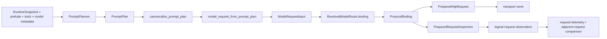

# 请求构建

请求构建负责把运行时上下文整理为 provider-neutral 的 prompt 计划和模型请求输入。它不承担 provider wire JSON 的序列化职责；协议格式化、请求体构造、请求检查和流解码由已解析路由上的 `ProtocolBinding` 负责。

## 当前请求链路

`build_request_with_policy`（`src/request_builder.rs`）创建 `PromptPlannerInput`，调用 `PromptPlanner::plan`，对结果执行 canonicalization，再返回包含 `PromptPlan` 和 `BudgetReport` 的 `BuildResult`。随后正常 turn 的 `TurnDriver` 将 plan 投影为 `ModelRequestInput`，由当前 `ResolvedModelRoute` 的 binding 准备最终 HTTP 请求。

请求阶段的职责边界如下：

- `request_builder`：运行时可见性投影、历史和 evidence 选择、预算、prompt segment 排序、稳定前缀元数据和逻辑观察所需的语义来源；
- `model_runtime::projection`：把 `PromptPlan` 转换为 `ModelRequestInput`，保留 segment/message origin、工具定义、生成设置和 `CacheIntent`；
- `ProtocolBinding`：按 route 的 protocol、profile、capability 和 protocol settings，将 `ModelRequestInput` 转换为 `PreparedHttpRequest`，并创建对应的 stream decoder；
- `ModelRuntime`：发送 prepared request，消费 decoder 产生的 `ModelEvent`，处理响应终止状态、物理重试和 one-shot 执行；
- Agent：把 binding-owned inspection 转换为不包含 prompt bytes 的逻辑 request observation，并记录 request telemetry。

`PreparedHttpRequest` 包含 HTTP method、URL、协议 headers、body 和 prompt unit origins。`PreparedRequestInspection` 包含 request shape、prompt unit identity/semantic segment IDs 以及 binding 计算的 cache inspection。request builder 只消费 inspection 提供的语义单位，不解析 protocol body。

## 运行时可见性与 PromptPlan

`RuntimeSnapshot` 是 provider-visible prompt material 的来源。`runtime_projection` 只选择 active、未被 compaction 排除且不与 retired source span 重叠的 runtime frame，并将其中的 protocol item 转换为 `ProtocolFrame`。ContextView 和 context tree 仍用于展示、导航和工具寻址；它们不会直接拼接成 provider request。

`protected_start_index_for_snapshot` 依据 protected frame ID 在 provider-visible frame 中计算受保护边界。若没有匹配的 protected frame，边界位于 frame 列表末尾。

`PromptPlan` 是 provider-neutral 的 prompt segment 列表。segment 记录 role、contributor、provenance、stability、retention、protection、token estimate、text 以及 typed content。typed content 覆盖普通文本、structured user content、assistant tool calls 和 tool output；它不是某个 provider 的 wire message。

`PromptPlannerInput` 包含 model metadata、model ID、prelude、runtime snapshot、工具定义、可选 frozen evidence 和 protected-context policy。planner 会：

1. 从 snapshot 取得 provider-visible protocol frames；
2. 计算 protected boundary、历史保留范围和 evidence 预算；
3. 保持完整的 tool-call/tool-output batch；
4. 组装 required prelude、runtime material、protected suffix、evidence 和 typed history segments；
5. 生成稳定的 contributor/segment identity 和 token report。

canonicalization 将 stable kernel、envelope、evidence、durable context、history 和 current-turn group 排成确定顺序，并重新计算 cache metadata。连续 stable segment 前缀是 cache-eligible prefix；`PromptPlan::stable_prefix_hash` 和 token report 只描述 plan 层面的稳定性。

## 预算与历史保留

输入预算由 model metadata、output reserve、effective input limit 和工具定义计算。模型不支持 tools 时，工具 token 不计入预算。protected context 单独超出输入预算时直接返回错误，不静默丢弃受保护内容。

历史保留以 retention unit 为边界。assistant tool call 与对应 tool output 作为一个原子 batch；如果 protected boundary 落在 batch 内，会扩展到 batch 起点。evidence 使用独立预算，并将本次选择的 message 与 selected IDs 固定到当前逻辑 turn。

`BuildResult.budget` 同时记录 planner 估算和 canonical plan token report，包括 total、stable、volatile、cacheable-prefix 以及 boundary 后的 stable tokens。最终请求 admission 使用这些字段判断 prompt 与 tools 是否超出选择的 input budget。

## ModelRequestInput 与 ProtocolBinding

`model_request_from_prompt_plan`（`src/model_runtime/projection.rs`）把 plan segment 映射为语义输入：

- system/developer 文本进入 control segments；
- user、assistant、tool 内容进入 typed `ModelMessage`；
- assistant reasoning、tool calls 和 tool results 保留为 typed content；
- `ToolSpec` 转换为 `ToolDefinition`；
- model metadata 和 resolved route 生成 `GenerationSettings`；
- plan 的 stable prefix 与模型的 prompt-cache 配置生成 `CacheIntent`。

`ModelRequestInput` 还保存 `segment_origins` 和 `message_origins`，使 protocol binding 能把最终请求单位关联回 prompt plan。binding 是 route-bound 的 immutable protocol implementation；它不保存某次请求的 semantic input，也不把 provider fields 暴露给 request builder。

`ProtocolBinding` 提供：

- `prepare_request(&ModelRequestInput) -> PreparedHttpRequest`；
- `inspect_prepared_request(&PreparedHttpRequest, stable_request) -> PreparedRequestInspection`；
- `new_decoder() -> ModelStreamDecoder`；
- 基于 binding identity 的 replay compatibility 判断。

内置 binding 覆盖 Responses、Completions 和 Anthropic。每个 adapter 自己负责 protocol-specific request shape、headers、cache marker/key、reasoning 字段和终止/流事件解码；公共 runtime 只处理 provider-neutral contract。

## Cache inspection 与 telemetry

cache metadata 在 `PromptPlan` 层描述 stable prefix，在 `ModelRequestInput.cache` 中表达为 `CacheIntent`，最终由 `ProtocolBinding` 决定如何落到 wire request。binding 的 `PreparedRequestCacheInspection` 报告是否发送 cache hint、retention、local prefix fingerprint 和 routing key。

正常 turn 在 prepared request 完成后调用 binding inspection。`observe_prepared_model_request` 根据 inspection 的 prompt units 和 plan segment IDs 生成 process-local `LogicalRequestObservation`：它包含 request-shape digest、semantic category、token estimate、byte count 和 digest，不携带 prompt bytes，也不会序列化到 transcript。

Agent 将 observation 与 logical request ID、turn/iteration/attempt、model、protocol、工具数量和 budget 组合为 `LlmRequestTelemetry`。物理重试复用同一 logical request anchor；只有发生新的迭代、请求投影或 route 变化时才建立新的逻辑请求上下文。

## One-shot 请求

compaction 和其它窄用途 helper 使用 `build_oneshot_text_request` 构造只有受保护 user input 的最小 `PromptPlan`，关闭 reasoning、tools、parallel tool calls 和 Fast Mode。随后仍沿用同一条 `PromptPlan -> ModelRequestInput -> ProtocolBinding -> ModelRuntime` 链路。

`preflight_resolved_oneshot_text_request` 只做构建和 binding prepare 校验；`stream_resolved_oneshot_text_async` 由 `ModelRuntime::execute_text_oneshot` 执行，并要求 completed text terminal、无 tool calls。one-shot 使用调用方提供的 resolved route，并沿用该 route 的 binding、transport 和 decoder。

## 源码索引

- `src/request_builder.rs` — planner 入口、预算、`BuildResult`、logical request observation。
- `src/request_builder/prompt_plan.rs` — `PromptPlan`、segment、canonicalization、cache metadata 和 token report。
- `src/request_builder/history_budget.rs` — protected context、history retention、tool-call batch 和 evidence budget。
- `src/request_builder/runtime_projection.rs` — provider-visible runtime frame projection。
- `src/model_runtime/projection.rs` — `PromptPlan` 到 `ModelRequestInput` 的投影。
- `src/model_runtime/mod.rs` — `ProtocolAdapter`、`ProtocolBinding`、`ModelRequestInput`、`PreparedHttpRequest` 和 inspection types。
- `src/model_runtime/adapters.rs` — 内置 protocol adapter、binding、wire preparation 和 decoder。
- `src/model_runtime/runtime.rs` — `ModelRuntime`、physical retry、event accumulation 和 one-shot execution。
- `src/agent/protocol_stream.rs` — normal turn 的 request preparation、inspection、telemetry 和 driver glue。
