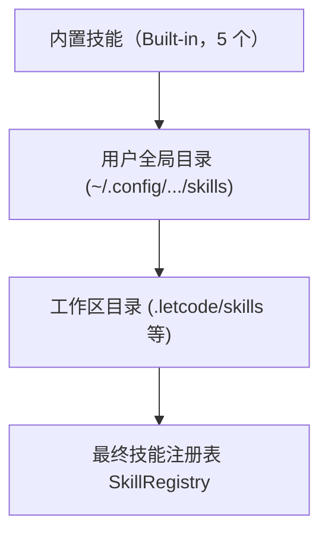

# 技能系统

letcode 提供基于 `SKILL.md` 规范的技能系统（Skills）。技能用于封装特定任务领域的操作指南、工具调用经验与代码参考，便于模型在处理复杂工程时按需加载。

## 技能结构与规范

每个技能以独立目录形式组织，核心入口文件为 `SKILL.md`：

```text
my-skill/
├── SKILL.md
└── references/
    └── guide.md
```

`SKILL.md` 开头必须包含 YAML 元数据标头（Frontmatter）：

```markdown
---
name: my-skill
description: 描述该技能的具体应用场景与触发时机
---

# 技能正文

这里是详细的操作指南与约束规则……
```

格式约束如下：

- 技能名称 `name`：限制在 64 字符以内，由小写字母、数字与连字符组成；
- 触发说明 `description`：明确该技能的专长与调用条件，供模型在前言阶段识别匹配；
- 资源文件大小：单个 Markdown 文件或资源文件大小不超过 1 MB，目录深度不超过 4 层。

## 发现机制与加载优先级

系统启动时自动扫描内置资源、用户配置与当前工作区，按优先级构建技能注册表 `SkillRegistry`：



优先级从低到高排列如下：

1. **内置技能**：系统内嵌的 `customize-letcode`、`git`、`verification-planning`、`worktrees` 和 `simplify`；
2. **用户全局技能**：依次扫描 `~/.config/opencode/skills`、`~/.agents/skills`、`~/.claude/skills` 与 `~/.config/letcode/skills`；
3. **工作区项目技能**：从当前目录向上递归扫描至包含 `.git` 的根目录，识别其中的 `.agents/skills`、`.claude/skills`、`.opencode/skills` 和 `.letcode/skills`。

高优先级的同名技能会自动覆盖低优先级技能。工作区级别的定义始终优先于全局配置。

## 前言轻量注入与按需调用

为了节省模型的上下文 Token，系统不会在会话启动时将所有技能全文拼入系统提示。

系统采用轻量级卡片机制注入前言：

1. 系统在回合前言（Prelude）中生成紧凑的技能清单，仅列出技能名称、用途说明与来源路径；
2. 模型根据当前任务意图自行判断是否需要引入特定技能；
3. 需要时，模型显式调用 `skill` 工具加载完整的 `SKILL.md` 正文；
4. 若技能附带子目录资源，模型可通过 `skill__resource_list` 列举资源文件，并使用 `skill__resource_read` 按需读取。

该机制确保未使用的技能不会占用输入预算，只有真正需要的专业知识才会载入上下文。

## 上下文压缩保护

当会话达到 Token 上限并触发上下文压缩时，系统会重新组织历史记录。

普通工具的冗长输出可能会被清理或折叠，但通过 `skill` 工具成功加载的技能规范会被识别为结构化材料。系统在压缩阶段安全保留已物化的核心规范，避免关键工程准则在长交互中丢失。

## 源码索引

- `src/skills.rs`：定义技能元数据结构、文件解析、目录扫描优先级与注册表逻辑。
- `src/tool/skills.rs`：实现供模型调用的 `skill`、`skill__resource_list` 和 `skill__resource_read` 工具。
- `src/runtime_context.rs`：将技能轻量卡片转换为面向服务商的回合前言帧。
- `src/context_history.rs`：处理上下文压缩时对已物化技能内容的结构化保留。
