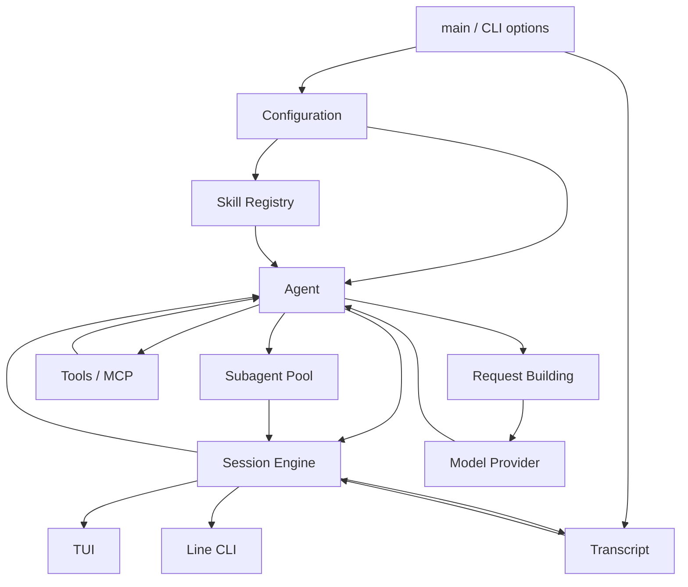
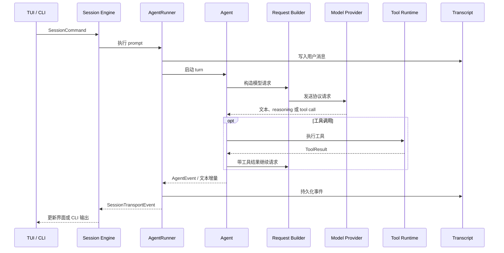

# letcode 技术文档

## 系统结构

letcode 启动后加载配置、指令文件和 Skills，创建 Agent 与 Transcript，然后启动 Session Engine。TUI、交互式 CLI 和单次 CLI 都通过 Session Engine 提交命令并接收执行事件。

`src/main.rs` 中的启动过程依次完成：

1. 解析运行模式、版本、更新和配置检查命令；
2. 加载 `letcode.toml` 和日志配置；
3. 根据当前 Provider 和 Model 创建 Agent；
4. 加载全局与工作区指令；
5. 配置模型协议、上下文压缩、重试、权限和工具并发；
6. 加载 Skill Registry 并注册 Skill 工具；
7. 创建 Transcript，写入 Session 启动记录；
8. 启动 Session Engine；
9. 将 Session Engine 交给 TUI、交互式 CLI 或单次 CLI。

## 组件

### [Session](components/session.md)

Session Engine 的启动和通道、Session Command、Agent turn 执行、前端事件、会话切换、历史导航与恢复。

### [Agent](components/agent.md)

Agent 的运行状态、turn 循环、模型流处理、工具调用、自动继续、上下文压缩和完成过程。

### [Request Building](components/request-building.md)

模型请求的 Prompt 规划、历史预算、运行时投影、工具描述、Prompt Cache 和 Provider 协议序列化。

### [Transcript](components/transcript.md)

Session 的 JSONL 记录、Recorder、Journal、上下文分支、运行状态投影、Session 索引和恢复数据。

### [Tools](components/tools.md)

工具注册、模型工具定义、参数校验、执行与流式输出、权限审批、超时、进程控制和 MCP 工具接入。

### [Subagents](components/subagents.md)

内置专家、子 Agent 创建、模型路由、前台与后台运行、Pool job、路径锁、事件转发和结构化结果。

## 一次交互的运行路径

## 源码入口

| 区域 | 入口 |
| --- | --- |
| 程序启动 | `src/main.rs`、`src/cli.rs` |
| 配置 | `src/config.rs`、`src/config/` |
| Session | `src/session/engine.rs`、`src/session/runner.rs` |
| Agent | `src/agent.rs`、`src/agent/protocol_stream.rs` |
| 模型请求 | `src/request_builder.rs`、`src/request_builder/provider_serialization.rs` |
| Transcript | `src/transcript.rs`、`src/transcript/recorder.rs` |
| 工具 | `src/tool.rs`、`src/tool/registry.rs` |
| 子代理 | `src/subagent.rs`、`src/subagent/pool.rs` |
| TUI | `src/tui/runtime.rs`、`src/tui/state/` |
