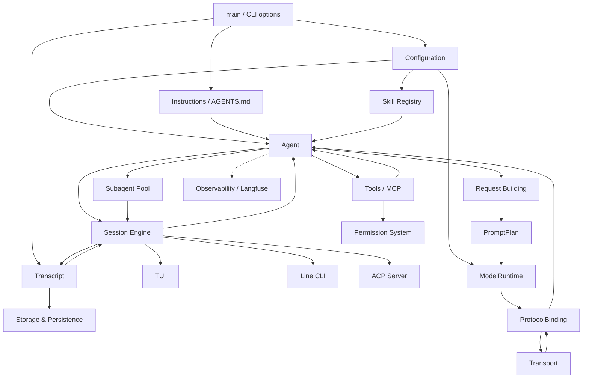
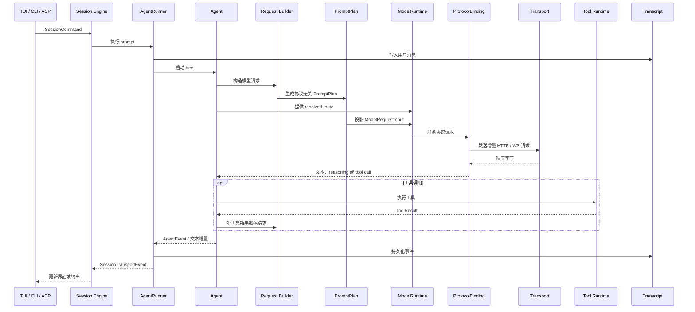

# letcode 技术文档

## 系统结构

letcode 启动时先加载配置、指令文件和技能，创建 Agent 与 Transcript，再启动 Session Engine。TUI、交互式 CLI、单次 CLI 或外部 ACP 客户端均通过 Session Engine 提交命令，并接收执行事件。

`src/main.rs` 中的启动过程依次完成：

1. 解析运行模式、版本号、更新检查与配置校验命令；
2. 加载 `letcode.toml` 与日志配置；
3. 校验服务商与模型配置，创建不可变的 `ProtocolRegistry`、`ResolvedRuntimeCatalog` 和当前 `ResolvedModelRoute`；
4. 创建 Agent 并安装当前已解析路由；
5. 加载全局指令与工作区 `AGENTS.md` 指令链；
6. 初始化上下文压缩、重试策略、权限模式与工具并发配置；
7. 加载技能注册表并注册技能工具；
8. 创建 Transcript，写入会话启动记录并建立文件写锁；
9. 启动 Session Engine；
10. 将 Session Engine 交付给选定的前端运行环境（TUI、交互式 CLI、单次 CLI 或 ACP 服务端）。

## 组件

### [Session](components/session.md)

管理 Session Engine 启动与通信通道，分发会话命令，驱动回合执行，派发前端事件，并处理会话切换、历史导航与状态恢复。

### [Agent](components/agent.md)

维护 Agent 运行状态与已解析路由，统一编排回合流程，调度工具调用、自动继续、上下文压缩与完成处理。

### [Instructions](components/instructions.md)

管理基于 `AGENTS.md` 的层级指令发现与加载链，定义面向各大模型协议的高权威原生指令注入契约。

### [Request Building](components/request-building.md)

负责模型请求的 Prompt 规划、上下文预算分配、运行时投影与工具描述。Prompt 缓存、网络传输格式编码与流式解码由各协议绑定实现。

### [Model Runtime](components/model-runtime.md)

负责大语言模型的底层网络通信与协议适配，内置 Responses、Completions 和 Anthropic 适配器，支持 WebSocket 传输与流式事件归一化。

### [Transcript](components/transcript.md)

负责基于 schema v2 的 JSONL 日志、统一 `AssistantTurn` 格式、事务提交、上下文分支与状态投影，同时提供 schema v1 日志恢复。

### [Context History](components/context-history.md)

基于内置的 Historian 专家实现会话历史的三档增量整理与上下文压缩，配合独立后台任务维护工作区隔离的项目记忆库。

### [Storage](components/storage.md)

阐明系统的本地磁盘存储拓扑，涵盖会话日志落盘、跨进程独占写锁、大体积产物折叠、会话发现索引与 SQLite 项目记忆库。

### [Tools](components/tools.md)

提供本地工具注册、模型工具定义生成、参数校验、执行流式输出、权限审批、超时控制、进程清理与 MCP 外部工具接入。

### [Permission](components/permission.md)

实现四种权限运行模式、工具安全分类、会话级授权机制、自动化智能审查以及子代理独占路径锁。

### [Subagents](components/subagents.md)

管理内置专家模板、子 Agent 实例、模型路由解析、前后台运行、任务池调度、文件路径锁、事件转发与结构化结果聚合。

### [Skills](components/skills.md)

管理基于 `SKILL.md` 规范的技能系统，支持多级目录发现、前言轻量级卡片注入、动态按需加载与上下文压缩保护。

### [ACP](components/acp.md)

提供标准 Agent Client Protocol（ACP）协议服务端，支持外部编辑器（如 Zed）或自动化调度中心通过标准输入输出连接并驱动会话。

### [TUI](components/tui.md)

基于 Ratatui 的终端用户界面，提供流式对话展示、思考块折叠、原生 Markdown、原生 LaTeX 公式与 Mermaid 矢量图表渲染、斜杠命令及多语言切换。

### [Configuration](components/configuration.md)

定义系统配置规范，涵盖全局运行边界、物理重试策略、外部 MCP 服务接入、服务商凭据、模型参数与专家路由配置。

### [CLI](components/cli.md)

介绍命令行界面的全部子命令与参数，包括交互式 REPL、单次批处理运行（`-p` / `--json`）、会话恢复、脱机配置校验与二进制自动升级。

### [Fake Disguise](components/fake.md)

说明客户端特征仿真机制，涵盖网络传输元数据封装、真实宿主环境探测、Codex 与 Anthropic 传输剖面以及动态启闭控制。

### [Observability](components/observability.md)

提供多层级的运行时可观测性，涵盖进程内逻辑请求观测、结构化请求遥测、Prompt 缓存指标以及基于 Langfuse 的分布式调用追踪。

## 一次交互的运行路径

## 源码入口

| 区域 | 入口 |
| --- | --- |
| 命令行与启动 | `src/main.rs`、`src/cli.rs` |
| 配置管理 | `src/config.rs`、`src/config/` |
| 指令系统 | `src/agent.rs`（`load_workspace_instructions`） |
| Session | `src/session/engine.rs`、`src/session/runner.rs` |
| Agent | `src/agent.rs`、`src/agent/protocol_stream.rs` |
| 模型运行时 | `src/model_runtime/`（`ModelRuntime`、`ProtocolBinding`、`ResolvedProviderTransport`） |
| 模型请求 | `src/request_builder.rs`、`src/request_builder/prompt_plan.rs` |
| Transcript | `src/transcript.rs`、`src/transcript/recorder.rs` |
| 存储与持久化 | `src/transcript/recorder.rs`、`src/tool/fold_artifact.rs` |
| 历史与记忆 | `src/context_history.rs`、`src/project_memory/` |
| 工具系统 | `src/tool.rs`、`src/tool/registry.rs` |
| 权限系统 | `src/permission.rs` |
| 技能系统 | `src/skills.rs` |
| 子代理 | `src/subagent.rs`、`src/subagent/pool.rs` |
| ACP 协议 | `src/acp/` |
| 客户端仿真 | `src/fake.rs` |
| TUI 界面 | `src/tui/runtime.rs`、`src/tui/timeline.rs` |
| 二进制更新 | `src/updater.rs` |
| 调用追踪与遥测 | `src/langfuse_trace.rs` |
